# Haystack Technical Architecture Documentation

This document provides a comprehensive overview of the Haystack framework's technical architecture, including detailed Mermaid diagrams that illustrate the system's components, data flows, and integration patterns.

## Table of Contents

1. [Overview](#overview)
2. [System Architecture](#system-architecture)
3. [Pipeline Architecture](#pipeline-architecture)
4. [Component Architecture](#component-architecture)
5. [Document Store Architecture](#document-store-architecture)
6. [Data Flow Patterns](#data-flow-patterns)
7. [Integration Architecture](#integration-architecture)
8. [Deployment Patterns](#deployment-patterns)

## Overview

Haystack is a production-ready, end-to-end LLM framework designed for building applications powered by Large Language Models, Transformer models, vector search, and more. The framework follows a modular, component-based architecture that enables flexible composition of NLP pipelines.

### Core Principles

- **Modular Design**: Components can be mixed and matched to create custom pipelines
- **Technology Agnostic**: Support for multiple LLM providers and models
- **Scalable**: Production-ready components for handling large-scale deployments
- **Extensible**: Easy to add custom components and integrations

## System Architecture

### High-Level Architecture

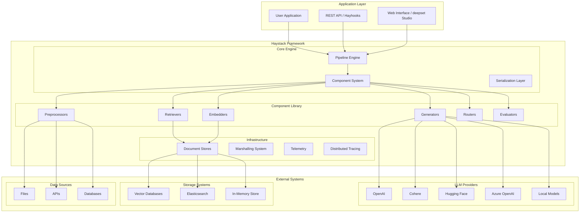

### Core Modules

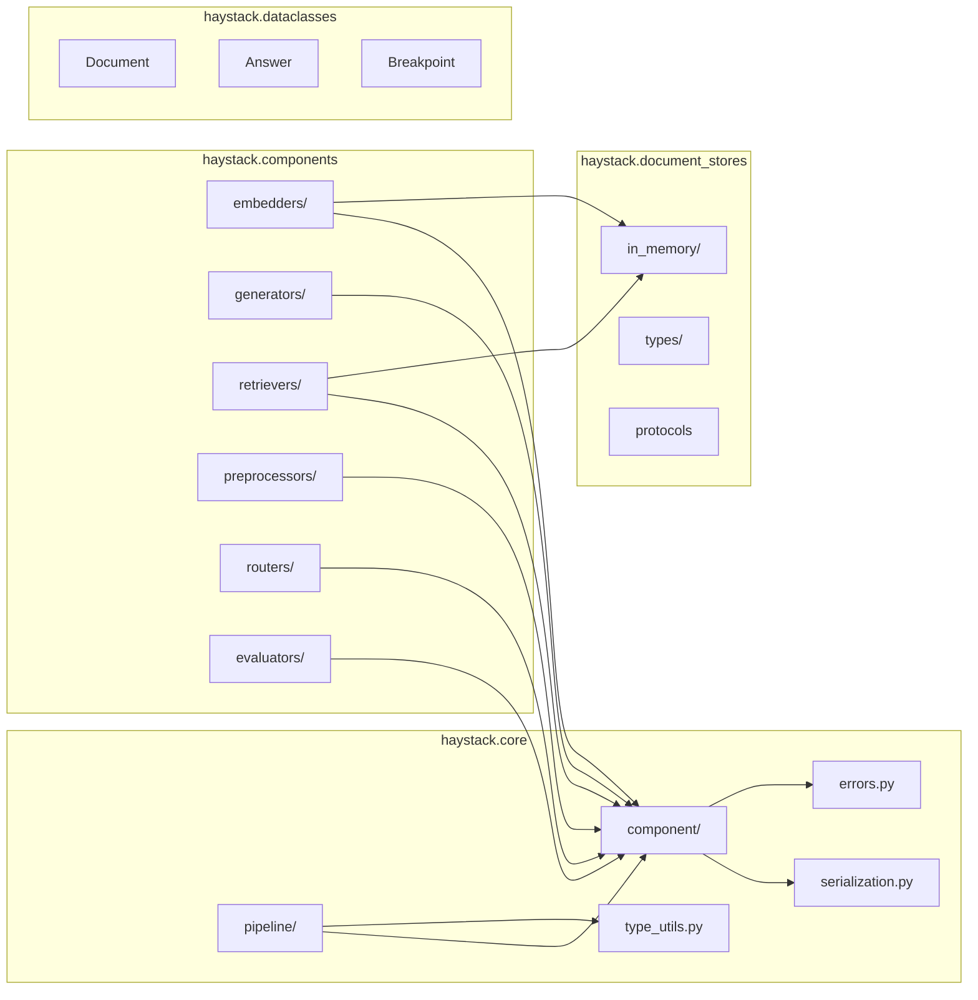

## Pipeline Architecture

### Pipeline Execution Model

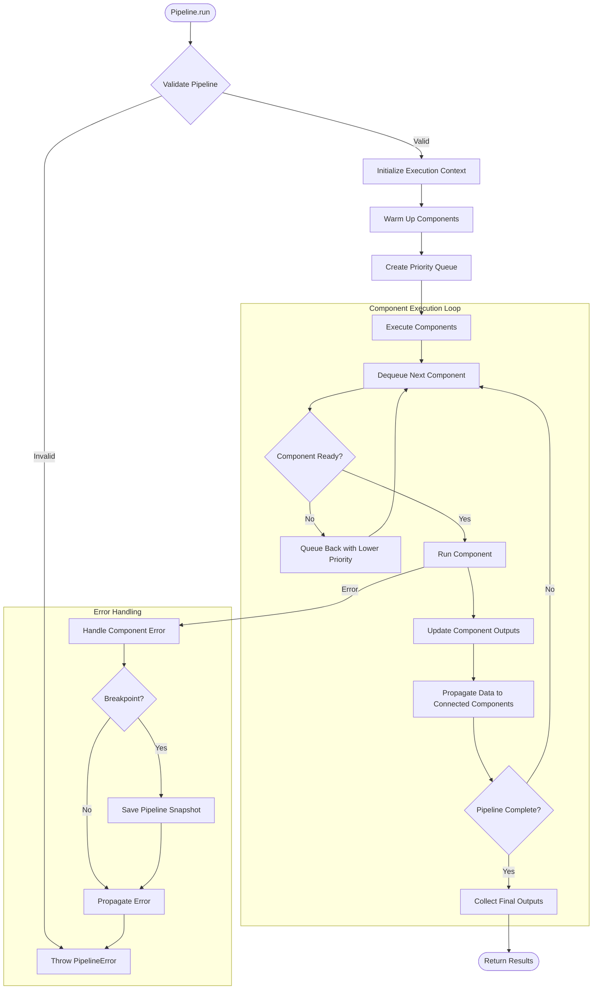

### Pipeline Graph Structure

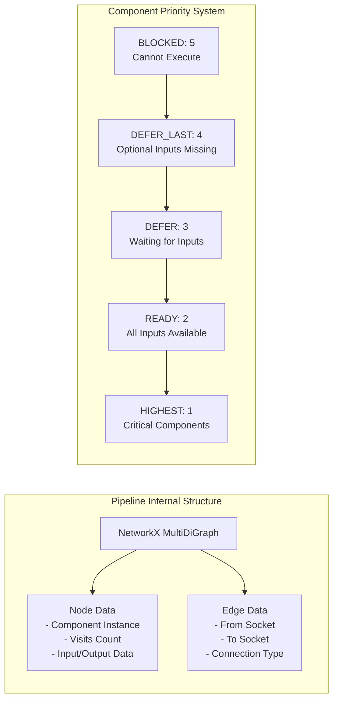

### Synchronous vs Asynchronous Execution

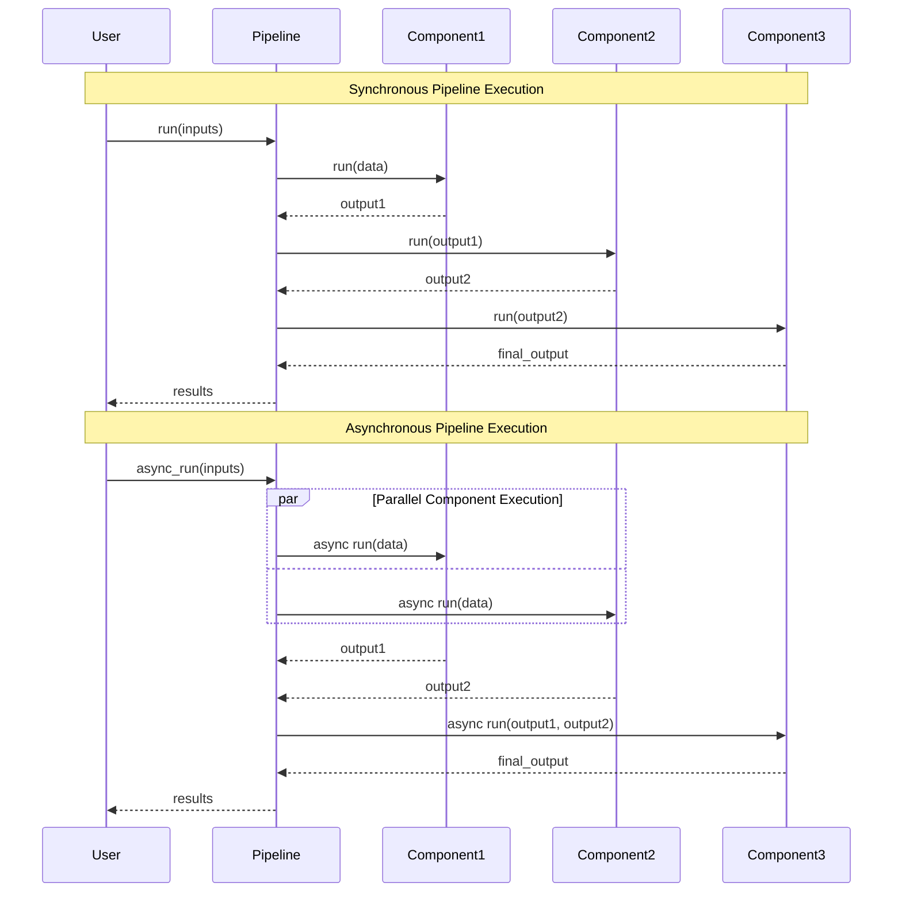

## Component Architecture

### Component Lifecycle

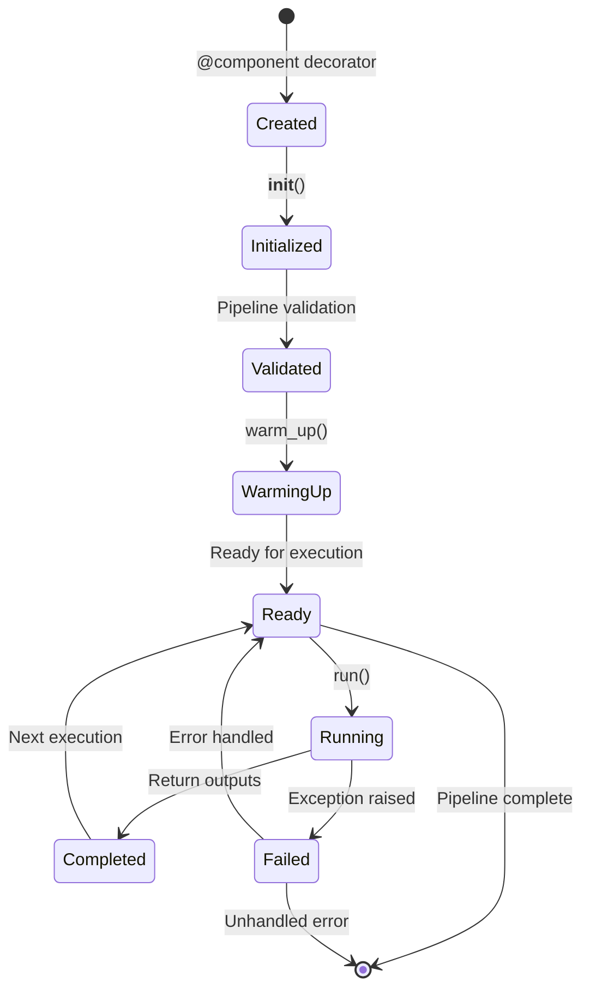

### Component Interface Contract

```mermaid
classDiagram
    class Component {
        <<Protocol>>
        +run(**kwargs) dict[str, Any]
        +warm_up() None
        +to_dict() dict[str, Any]
        +from_dict(dict) Component
    }

    class ComponentMetadata {
        +init_parameters: dict
        +input_types: dict
        +output_types: dict
        +component_config: ComponentConfig
    }

    class InputSocket {
        +name: str
        +type: Any
        +default_value: Any
        +is_variadic: bool
        +is_greedy: bool
    }

    class OutputSocket {
        +name: str
        +type: Any
    }

    Component ||--o{ InputSocket
    Component ||--o{ OutputSocket
    Component ||--|| ComponentMetadata

    class ConcreteComponent {
        +run(**kwargs) dict[str, Any]
        +warm_up() None
        -_component_init()
        -_validate_run_input()
    }

    ConcreteComponent --|> Component
```

### Component Types and Hierarchy

```mermaid
graph TD
    COMPONENT[Component Base] --> GENERATOR[Generator Components]
    COMPONENT --> RETRIEVER[Retriever Components]
    COMPONENT --> EMBEDDER[Embedder Components]
    COMPONENT --> PREPROCESSOR[Preprocessor Components]
    COMPONENT --> ROUTER[Router Components]
    COMPONENT --> EVALUATOR[Evaluator Components]

    GENERATOR --> OPENAI_GEN[OpenAI Generator]
    GENERATOR --> COHERE_GEN[Cohere Generator]
    GENERATOR --> HF_GEN[Hugging Face Generator]
    GENERATOR --> LOCAL_GEN[Local Generator]

    RETRIEVER --> VECTOR_RET[Vector Retriever]
    RETRIEVER --> BM25_RET[BM25 Retriever]
    RETRIEVER --> HYBRID_RET[Hybrid Retriever]

    EMBEDDER --> SENTENCE_EMB[Sentence Transformer Embedder]
    EMBEDDER --> OPENAI_EMB[OpenAI Text Embedder]
    EMBEDDER --> HF_EMB[Hugging Face Embedder]

    PREPROCESSOR --> FILE_CONV[File Converter]
    PREPROCESSOR --> TEXT_SPLIT[Text Splitter]
    PREPROCESSOR --> TEXT_CLEAN[Text Cleaner]

    ROUTER --> CONDITIONAL[Conditional Router]
    ROUTER --> META_ROUTER[Metadata Router]
    ROUTER --> LLM_ROUTER[LLM-based Router]

    EVALUATOR --> FAITHFULNESS[Faithfulness Evaluator]
    EVALUATOR --> RELEVANCE[Answer Relevance Evaluator]
    EVALUATOR --> SIMILARITY[Semantic Answer Similarity]
```

## Document Store Architecture

### Document Store Interface

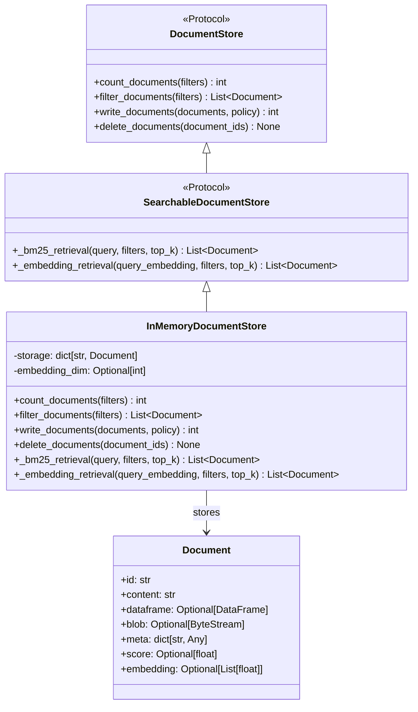

### Document Storage Patterns

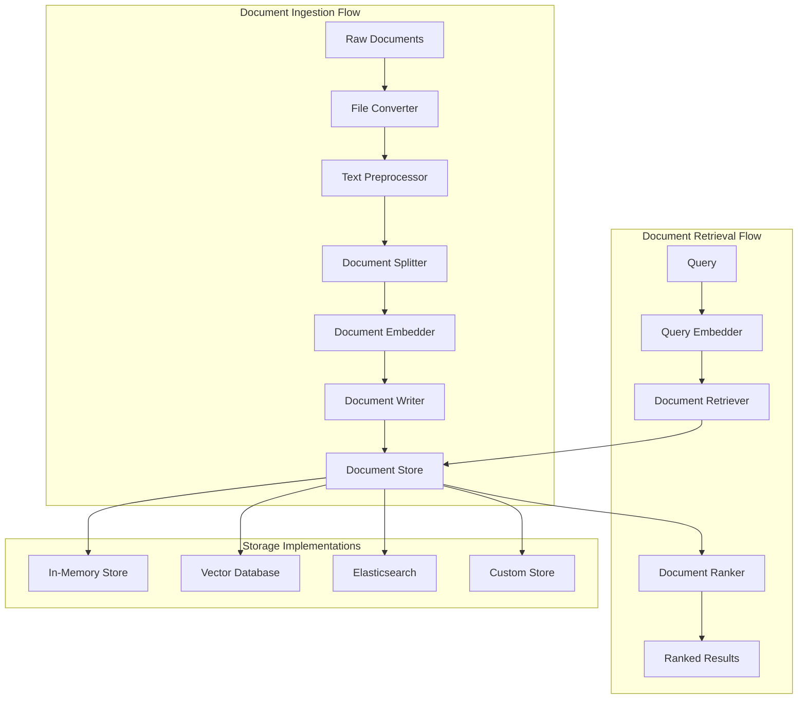

## Data Flow Patterns

### RAG (Retrieval-Augmented Generation) Pipeline

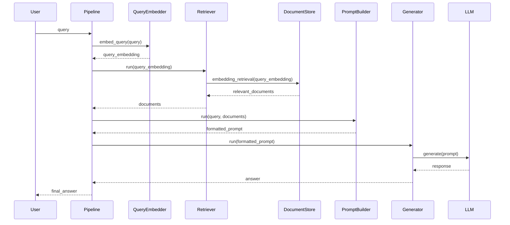

### Document Processing Pipeline

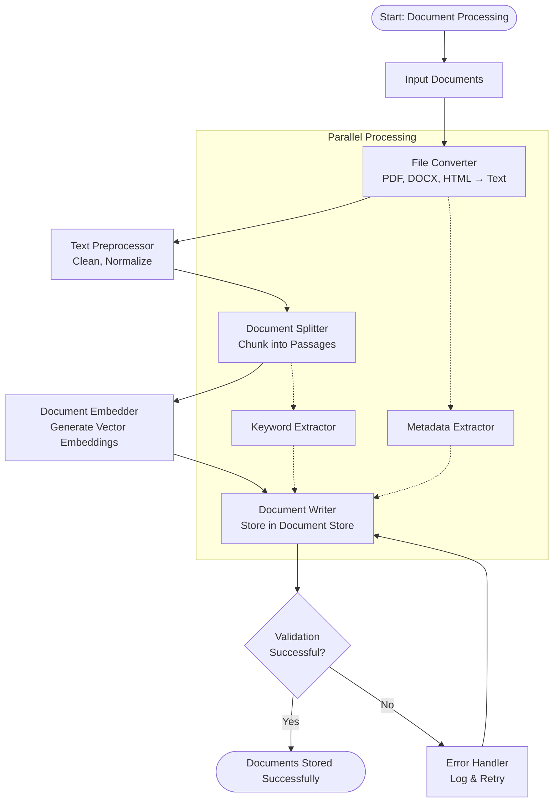

### Multi-Modal Pipeline Architecture

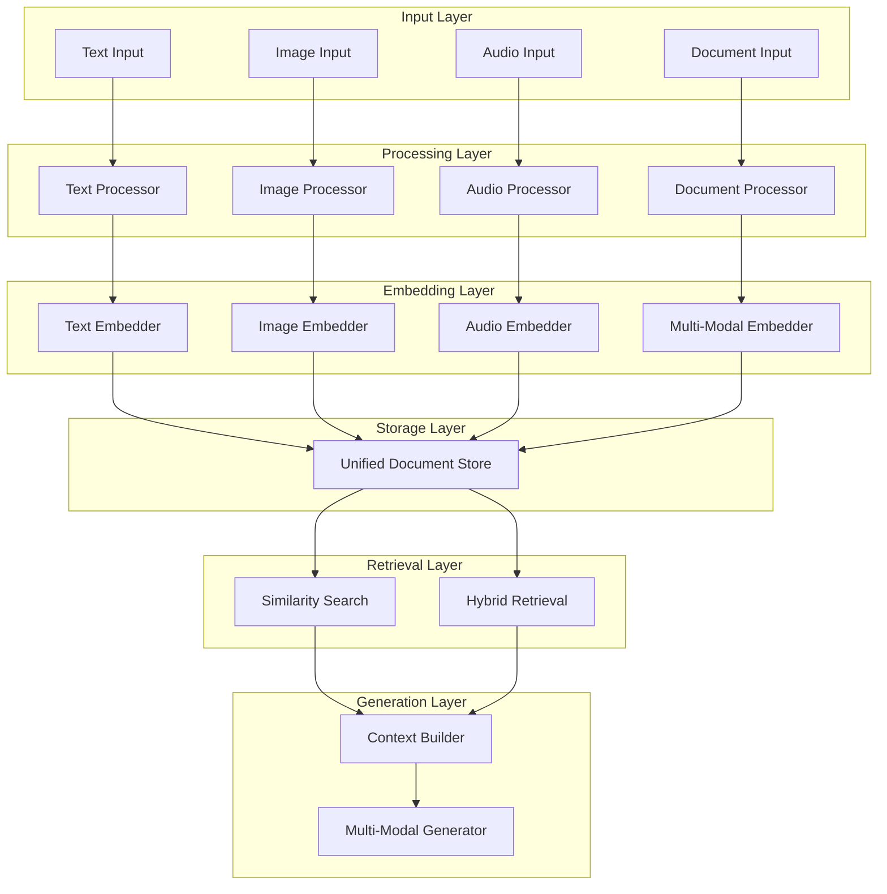

## Integration Architecture

### External LLM Provider Integration

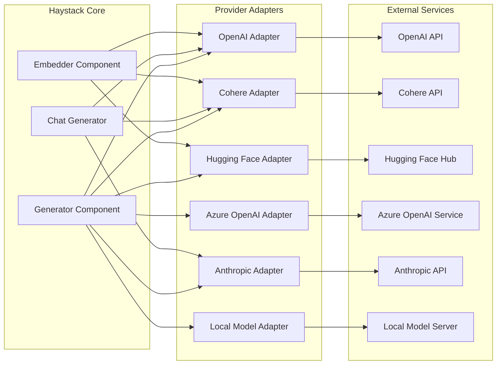

### Vector Database Integration Patterns

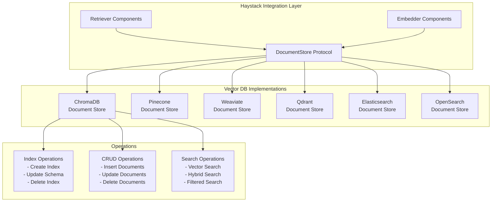

## Deployment Patterns

### Development vs Production Architecture

```mermaid
graph TB
    subgraph "Development Environment"
        DEV_APP[Development Application]
        DEV_PIPELINE[Pipeline with In-Memory Store]
        DEV_LOCAL_MODEL[Local Models]
        DEV_FILES[Local Files]
    end

    subgraph "Staging Environment"
        STAGE_APP[Staging Application]
        STAGE_PIPELINE[Pipeline with External DB]
        STAGE_CLOUD_MODEL[Cloud Models]
        STAGE_S3[S3 Storage]
    end

    subgraph "Production Environment"
        subgraph "Load Balancer Layer"
            LB[Load Balancer]
        end

        subgraph "Application Layer"
            PROD_APP1[Production App Instance 1]
            PROD_APP2[Production App Instance 2]
            PROD_APP3[Production App Instance N]
        end

        subgraph "Pipeline Layer"
            ASYNC_PIPELINE[Async Pipeline Engine]
            COMPONENT_POOL[Component Pool]
        end

        subgraph "Infrastructure Layer"
            VECTOR_DB_CLUSTER[Vector DB Cluster]
            CACHE_LAYER[Redis Cache]
            MODEL_API[Model API Gateway]
            MONITORING[Monitoring & Logging]
        end
    end

    DEV_APP --> DEV_PIPELINE
    DEV_PIPELINE --> DEV_LOCAL_MODEL
    DEV_PIPELINE --> DEV_FILES

    STAGE_APP --> STAGE_PIPELINE
    STAGE_PIPELINE --> STAGE_CLOUD_MODEL
    STAGE_PIPELINE --> STAGE_S3

    LB --> PROD_APP1
    LB --> PROD_APP2
    LB --> PROD_APP3

    PROD_APP1 --> ASYNC_PIPELINE
    PROD_APP2 --> ASYNC_PIPELINE
    PROD_APP3 --> ASYNC_PIPELINE

    ASYNC_PIPELINE --> COMPONENT_POOL
    COMPONENT_POOL --> VECTOR_DB_CLUSTER
    COMPONENT_POOL --> CACHE_LAYER
    COMPONENT_POOL --> MODEL_API

    VECTOR_DB_CLUSTER --> MONITORING
    CACHE_LAYER --> MONITORING
    MODEL_API --> MONITORING
```

### Microservices Deployment with Hayhooks

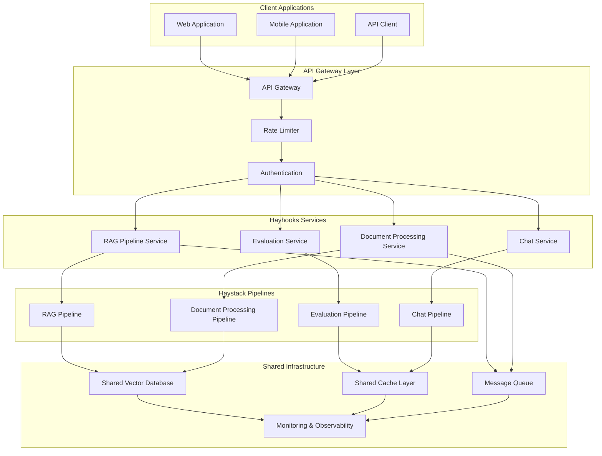

---

This architecture documentation provides a comprehensive technical overview of the Haystack framework. The diagrams illustrate the modular design, component interactions, data flows, and deployment patterns that make Haystack a powerful and flexible platform for building LLM applications.

For more information, refer to the [official Haystack documentation](https://docs.haystack.deepset.ai/) and the [API reference](https://docs.haystack.deepset.ai/reference/).
